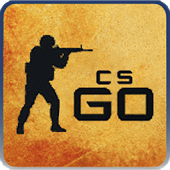

# Sequential-Bind-CSGO
This tool creates custom console commands, allowing you to cycle through a series of messages with a single keypress in CS:GO.
Edit: The commands also work for CS 2 :)

## Features

- **Customizable Messages:** Specify your chat messages by simply editing the "input.txt" file. Each line in the file represents a unique message.
- **Key Bind Configuration:** Choose the key you want to bind within the script (e.g., "o").
- **Automated Command Generation:** Run the script to generate an "output.txt" file containing all the necessary console commands for your bind.
- **Flexible Usage:** Execute each command individually in the CS:GO console or conveniently paste the commands into your autoexec.cfg file.

## Usage

1. Clone or download this repository to your local machine.
2. Edit the "input.txt" file to include your desired chat messages, one per line.
3. Inside the script, specify the key you want to bind (e.g., "o").

```py
if __name__ == "__main__":
    bind = SequentialBind("o") # <- change the key here
    with open("input.txt", "r", encoding="UTF-8") as f:
```

4. Run the script to generate the "output.txt" file with the required commands.
5. To activate your sequential bind, either:
    - Enter each command individually into the CS:GO console during gameplay.
    - Paste the generated commands into your CS:GO autoexec.cfg file for automatic execution on game launch.

### Binding via CS:GO Console

To activate your sequential bind during gameplay, manually enter each command into the CS:GO console.

### Binding via autoexec.cfg

To automatically execute the bind on game launch, follow these steps:

1. **Set Launch Options:**

   In Steam, right-click on "Counter-Strike: Global Offensive" in your game library and select "Properties." Click on the "Set Launch Options" button and enter "+exec autoexec.cfg" (without quotes). This instructs CS:GO to execute your `autoexec.cfg` file on startup.

   

2. **Create or Edit autoexec.cfg:**

   - Open a text editor of your choice and paste the generated console commands from "output.txt" into a new file.
   - Save the file with the name "autoexec.cfg."

3. **Move autoexec.cfg to the Correct Location:**

   - Navigate to your Steam library folder. The default path is usually:
     - **Local Disk (C:)** -> **Program Files (x86)** -> **Steam** -> **steamapps** -> **common** -> **Counter-Strike Global Offensive** -> **csgo** -> **cfg**.
   - Place the "autoexec.cfg" file into the "cfg" folder.

Now, when you launch CS:GO, your custom sequential bind will automatically be applied, enhancing your gaming experience.


**Note:** This program is provided for educational and entertainment purposes and is not officially endorsed by Valve Corporation, the developer of Counter-Strike: Global Offensive. Ensure compliance with CS:GO's terms of service when using this tool.

For more information, assistance, or to contribute to this project, please visit the [GitHub repository](https://github.com/GerberFelix/Sequential-Bind-CSGO).



---
**Disclaimer:** *This project is not affiliated with Valve Corporation. "Counter-Strike: Global Offensive" and its logo are trademarks or registered trademarks of Valve Corporation in the United States and other countries.*